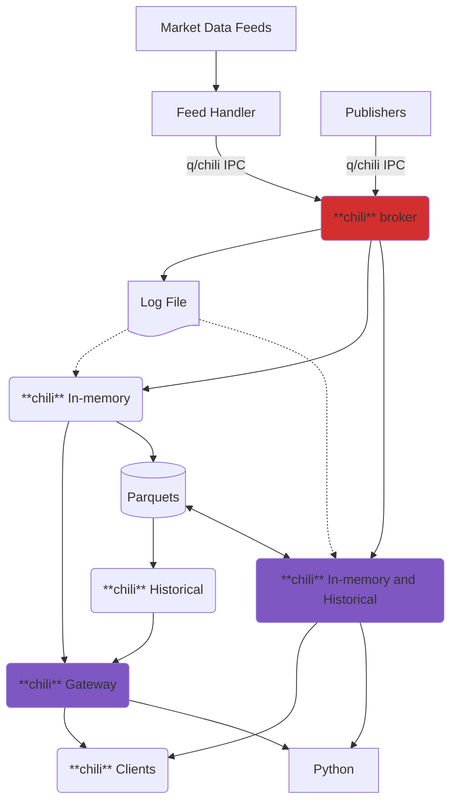

# Data Flow

```mermaid
graph TD
    A[Market Data Feeds]
    P0[Feed Handler]
    P1[Publishers]

    TP(**chili** broker)
    TL@{ shape: doc, label: "Log File" }

    Chili1(**chili** In-memory and Historical)
    Chili2(**chili** In-memory)
    Chili3(**chili** Historical)
    Chili4(**chili** Gateway)
    DB@{ shape: cyl, label: "Parquets" }

    C(**chili** Clients)
    PY[Python]

    A --> P0
    P0 --q/chili IPC--> TP
    P1 --q/chili IPC--> TP
    TP --> TL
    TP --> Chili2
    TL -.-> Chili2
    TP --> Chili1
    TL -.-> Chili1
    Chili2 --> Chili4
    Chili2 --> DB
    Chili3 --> Chili4
    DB --> Chili3
    Chili4 --> C
    Chili4 --> PY
    Chili1 --> C
    Chili1 --> PY
    DB <--> Chili1

    style TP fill:#D32F2F
    style Chili4 fill:#7E57C2
    style Chili1 fill:#7E57C2

```
