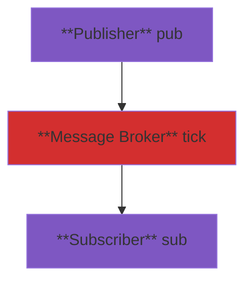

# Real-time case

## Overview

This example shows how to use `chili` to build a real-time data pipeline.



## Chili Source Code

=== "tick.chi"

    Start a message broker instance, listen at port 18000.

    ```bash
    chili ./src/chili/tick.chi -p 18000
    ```

    Source code:

    ```chili
    --8<-- "docs/src/chili/tick.chi"
    ```

=== "pub.chi"

    Start a publisher instance to publish data to the message broker, publish 10 records every second. `-i 1000` is required to trigger job every 1 second.

    ```bash
    chili ./src/chili/pub.chi -i 1000
    ```

    Source code:

    ```chili
    --8<-- "docs/src/chili/pub.chi"
    ```

=== "sub.chi"

    Start a subscriber instance to subscribe data from the message broker. Trade and quote tables shall be able to query on subscriber instance.

    ```bash
    pepper ./src/pepper/sub.chi
    ```

    Source code:

    ```pepper
    --8<-- "docs/src/pepper/sub.chi"
    ```

## Pepper Source Code

=== "tick.pep"

    Start a message broker instance, listen at port 18000.

    ```bash
    pepper ./src/pepper/tick.pep -p 18000
    ```

    Source code:

    ```pepper
    --8<-- "docs/src/pepper/tick.pep"
    ```

=== "pub.pep"

    Start a publisher instance to publish data to the message broker, publish 10 records every second. `-i 1000` is required to trigger job every 1 second.

    ```bash
    pepper ./src/pepper/pub.pep -i 1000
    ```

    Source code:

    ```pepper
    --8<-- "docs/src/pepper/pub.pep"
    ```

=== "sub.pep"

    Start a subscriber instance to subscribe data from the message broker. Trade and quote tables shall be able to query on subscriber instance.

    ```bash
    pepper ./src/pepper/sub.pep
    ```

    Source code:

    ```pepper
    --8<-- "docs/src/pepper/sub.pep"
    ```
